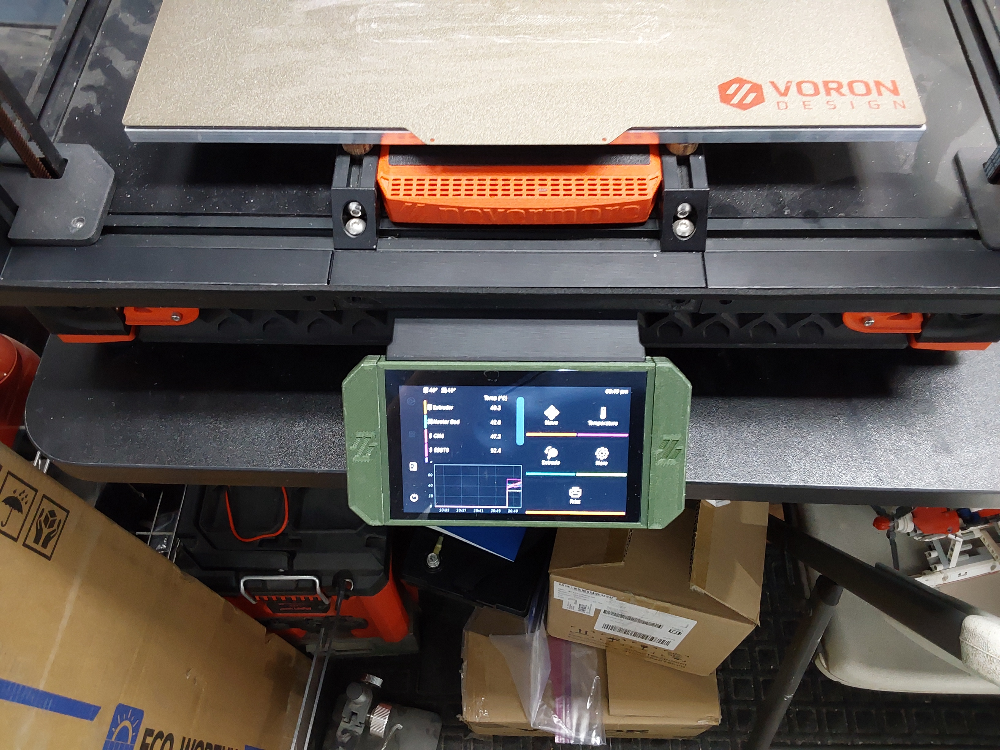
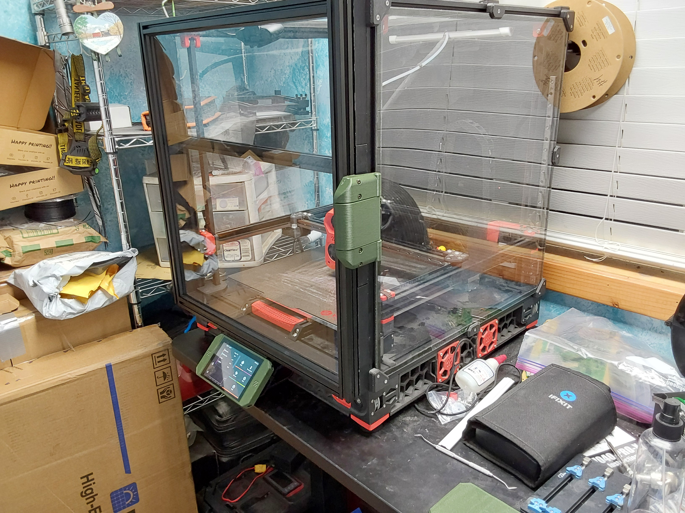
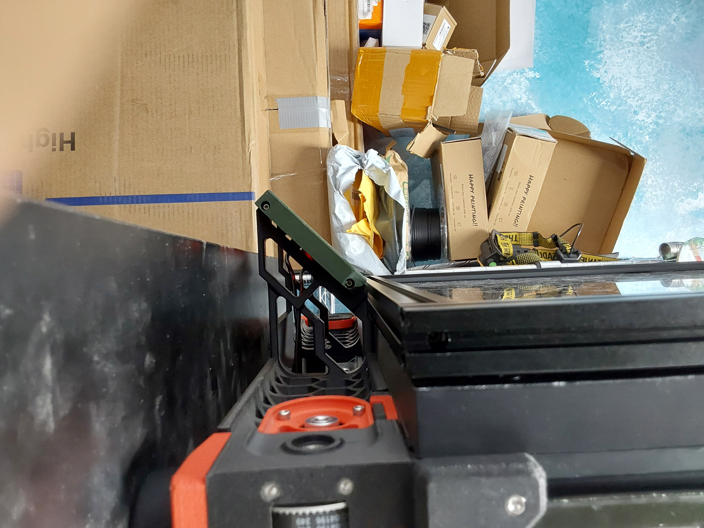
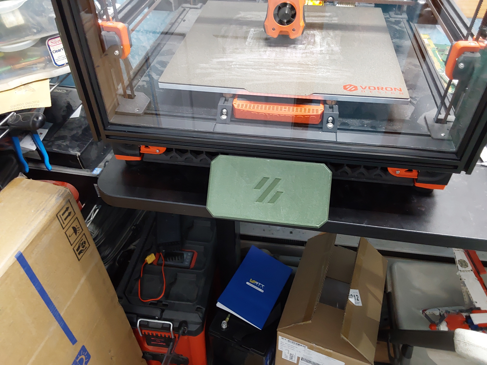

An extended bbt hdmi-5 mount for use with the [Clicky-Clack Fridge Door](https://github.com/tanaes/whopping_Voron_mods/tree/main/clickyclacky_door) 
and the [DraftShift Design](https://github.com/DraftShift) [Door Buffer v2](https://github.com/DraftShift/DoorBuffer).   [(Printables Link)](https://www.printables.com/model/1066444)

Print with regular voron recommended settings.

You will need to print 1 of each of the parts from the STL folder. No supports needed.   

Remixed from @DETMan's BTT HDMI5 Mount for Clicky Clack Door for use with the DraftShift Design Door Buffer.   [(Printables Link)](https://www.printables.com/model/861544)

Whom remixed it from @EDnation.   [(Printables Link)](https://www.printables.com/model/787236)

### Files to print:
  
* [1] TT HDMI5 Mount forClicky-Clack Fridge Doorwith Door Buffer v2.3mf
  
* [1] ORIG - BTT HDMI5 mount frame.stl

* [2] ORIG -BTT HDMI5 Cable protector-180 deg.stl

* [1] (optional) DET-Man BTT HDMI5 Display Cover.stl

* [1] (optional) DET-Man BTT HDMI5 Display Cover Logo Inlay.stl 

### BOM:

* [4] M3 Heatset inserts

* [8] M3x8 SHC

### Pictures:

### License: 
(Shared the same as the original)

Creative Commons LicenseThis work is licensed under a

Creative Commons (4.0 International License)

Attribution

✖ | Sharing without ATTRIBUTION

✔ | Remix Culture allowed

✔ | Commercial Use

✔ | Free Cultural Works

✔ | Meets Open Definition

